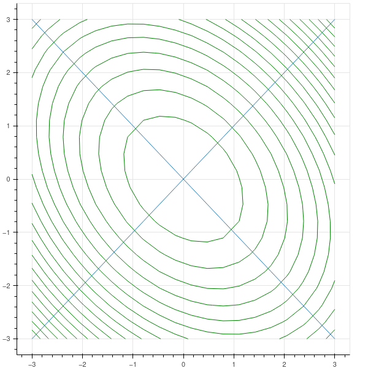

## Proof of the real spectral theorem

### Orthogonal bases and Gram-Schmidt

**Proposition:** (The Gram-Schmidt process)
Let $V$ be a real inner product space of dimension $n$, and let $v_1,\ldots, v_k$ be a linearly independent set in $V$.  Then there is a set $w_1,\ldots, w_k$ of vectors such that

- $\langle w_i, w_j\rangle=0$ if $i\not=j$.
- the span of $w_1, \ldots, w_l$ is the same as the span of $v_1,\ldots, v_l$ for $l\le k$. 

**Proof:** Let $w_1=v_1$ and 
$$
w_2 = v_2-\frac{\langle v_2, w_1\rangle}{\norm{w_1}^2}w_1.
$$
Then the span of $w_2$ and $w_1$ is the same as that of $v_2$ and $v_1$, and $\langle w_2, w_1\rangle=0$
by construction.
Now suppose we have constructed $w_1,\ldots, w_l$ with the desired property.  Set

$$
w_{l+1} = v_{l+1}-\sum_{i=1}^{l} \frac{\langle v_{l+1}, w_{i}\rangle}{\norm{w_{i}}^2}w_{i}.
$$

Then $\langle w_{l+1}, w_{i}\rangle=0$ and the span property is preserved.

### Orthogonal complements

If $W$ is a subspace of $V$, define $W^{\perp}=\lbrace v : \langle v,w\rangle=0\rbrace$.

**Proposition:** $W^{\perp}$ is a subspace of $V$.  Furthermore:

- $\dim W+\dim W^{\perp}=\dim V$ (so $W\cap W^{\perp}=0$.)
- $(W^{\perp})^{\perp}=W$.
- if $U\subset W$, then $W^{\perp}\subset U^{\perp}$.

**Proof:** Suppose $\dim W=k$ and $\dim V=n$. Use Gram-Schmidt to construct an orthogonal basis $v_1,\ldots, v_n$  for $V$
whose first $k$ elements are an orthogonal basis for $W$. A vector

$$
v=\sum a_{i}v_{i}
$$

is in $W^{\perp}$ if and only if $a_i=0$ for $i=1,\ldots, k$.

**Proposition:** Suppose that $A$ is a self adjoint operator and $AW\subset W$.  Then $AW^{\perp}\subset W^{\perp}$.

**Proof:** Suppose $z\in W^{\perp}$ and $w\in W$.  Then 

$$
\langle Az,w\rangle = \langle z, A^{\ast}w\rangle=\langle z, Aw\rangle = 0
$$

since $Aw\in W$. 

### Proof of the (real) spectral theorem

We have a self-adjoint map $A:V\to V$.  Pick a basis for $V$ and use Gram-Schmidt to construct
an orthonormal basis (an orthogonal basis where the elements all have norm $1$).

The $Q$-matrix for this basis is the identity, and so the inner product is just the dot product.

If $[A]$ is the matrix representation of $A$ in this basis, then the matrix representation of $A^{\ast}$
is the transpose of $[A]$.  So since $A$ is self-adjoint, $[A]$ is symmetric.

We know that a symmetric matrix has a real eigenvalue $\lambda_1$ with eigenvector $v_1$.  

Let $V_1$ be the orthogonal complement to the one-dimensional space $W$ spanned by $v_1$.  Since $v_1$ is
an eigenvector, $AW\subset W$.  Therefore $AV_1\subset V_1$.  Furthermore, if $x,y\in V_1$, then

$$
\langle Ax, y\rangle=\langle x, Ay\rangle
$$

so $A$ is self-adjoint as a linear map from $V_1$ to itself.  Thus we can continue by induction to construct
an orthogonal basis of eigenvectors for $A$.

### Orthogonal matrices

Let $Q\in M_{n}(\R)$ be a symmetric matrix.  As such it is a self adjoint map from $\R^{n}$ to itself
with respect to the usual dot product.  Therefore there is a basis $v_1,\ldots, v_n$ of $\R^{n}$
consisting of orthonormal eigenvectors for the dot product $Q$- eigenvalues $\lambda_1,\ldots, \lambda_n$.  

Let $P$ be the matrix whose columns are the vectors $v_{i}$ written in the standard basis of $\R^{n}$.
Since the $v_{i}$ are an orthonormal basis, the matrix $P$ satisfies $P^{T}P=I$.

At the same time, 

$$
QP=P\Lambda
$$

where $\Lambda$ is the diagonal matrix with entries $\lambda_{i}$. Since the $v_{i}$ are linearly independent,
the matrix $P$ is invertible and $Q$ is diagonalizable:

$$
P^{-1}QP=\Lambda
$$

The bilinear map $\langle v,w\rangle$ defined by

$$
\langle v,w\rangle= v^{T}Qw
$$

is an inner product provided that $\langle v,v\rangle\ge 0$ with equality only one $v=0$. If we write $v\not=0$
in terms of the orthogonal basis $v_1,\ldots, v_n$:

$$
v=\sum a_{i}v_{i}
$$

then we get 

$$
\langle v,v\rangle=(\sum a_{i}v_{i}^{T})Q(\sum a_{i}v_{i})=\sum a_{i}v_{i}^{T}\lambda_{i}v_{i}=\sum a_{i}^2\lambda_{i}v_{i}^{T}v_{i}
$$

which will be positive provided that all $\lambda_{i}>0$.

### Example

Let $Q$ be the symmetric matrix

$$
Q=\left(\begin{matrix} 3 & 1\\1 & 3\end{matrix}\right)
$$

Its eigenvalues are $2$ and $4$ with eigenvectors 

$$\left[\begin{matrix} -\sqrt{2} \\ \sqrt{2}\end{matrix}\right]$$

and 

$$
\left[\begin{matrix} 2\sqrt{2} \\ 2\sqrt{2}\end{matrix}\right].
$$

The norm of a vector in the inner product given by $Q$ is 

$$
\norm{(x,y)}=3x^2+2xy+3y^2
$$

The level curves of this are ellipses, and 
the eigenvectors point in the directions of the major and minor axes of the ellipse.

These ellipses are the family

$$
2(x-y)^2+4(x+y)^2=C
$$